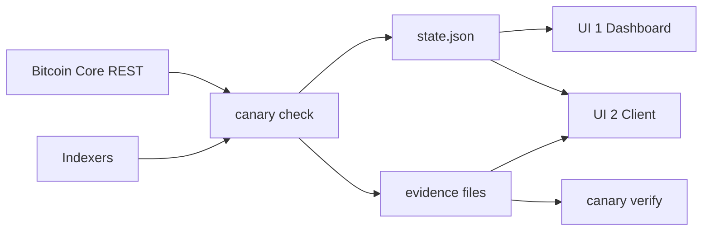

# Canary surface design

Canary has **two UIs**:

| | UI 1 — the Dashboard | UI 2 — the Client |
|---|---|---|
| What it is | the operator's local dashboard, served by `canary ui` | the public site, `site/dist`, built by `cmd/site` and deployed |
| Who uses it | the person who ran the check | a stranger who never installed anything |
| Scope | one run, on loopback, read-only | the claim, the docs, the recorded run, and the in-browser evidence checker |
| Lives in | `internal/ui`, `cmd/canary ui` | `cmd/site`, `cmd/verify-wasm` |

Everything else — the terminal, the state file, the evidence file — feeds these two and is
described after them.

This file says **which pages exist, in what order they nest, what each one lists, and what
each one must never say**. It is the requirements half of the design. The visual half —
colour, type, spacing, components — is [internal/ui/DESIGN.md](internal/ui/DESIGN.md), and
this file deliberately ignores it.

Sources of truth, in order: `docs/design/2026-09-30-v1-formats.md` for byte layouts, reason
codes, states and the CLI; `internal/ui/wording/copy.go` for every word either UI prints;
`docs/decisions.md` for why. This file adds no rule of its own — it collects the rules that
already bind the pages and turns them into a page tree.

Requirement words: **MUST** is a rule the code is held to today, **SHOULD** is the norm,
**MAY** is free choice. *v2* marks something `docs/roadmap/2026-09-30-feature-roadmap.md`
names and v1 does not build.



Both UIs share one design system (`internal/ui`) and **one wording table**
(`internal/ui/wording/copy.go`). No page of either UI may invent a word for a state, a
reason or a result.

---

## 1. Content rules every page of both UIs obeys

The requirement list from `CLAUDE.md`, "Claims and wording", turned into page requirements.

1. **Coverage first.** Every page that shows results **MUST** lead with per-block coverage
   and the lower-bound sentence (*a balance computed over blocks you could not verify is a
   lower bound, not a balance*). Canary is not an alarm box that looks dead when nothing
   fires.
2. **Accountable, not trustless.** The claim **MUST** read *accountable*, with its two
   conditions beside it: at least one honest indexer publishing commitments, and an
   uncensored path to a relay carrying them.
3. **Checked means the tweak list.** Anywhere coverage is shown or claimed, the page
   **MUST** state that the output side is not checked: a server can serve the right tweak
   and drop the output a wallet matches. Named now, fixed in v2.
4. **"Proves" needs the receipt condition.** A page **MUST NOT** say a finding is provable
   unless the evidence file carries a receipt and checks out.
5. **Disputed ≠ compromised.** *Servers disagree* names two servers and accuses neither.
   *Data withheld* names one server shown to have withheld data.
6. **Six labels, full meaning.** Pages **MUST** use the six labels as the formats document
   defines them and **MUST NOT** narrow one to its commonest example. *Can't be checked* is
   neither a pass nor an accusation. *Not checked* also covers a server that did not answer.
7. **Limits next to claims.** Every claim **MUST** carry its limit on the same page, and
   **SHOULD** link to the same limits text everywhere.
8. **No forbidden claim.** A page **MUST NOT** say trustless, secure, guaranteed, first,
   "Bitshala's own indexer", amounts, a score, "provably key-free", or v1 on mainnet/signet.
   v1 is *built and tested on regtest only*; its tests use a synthetic chain. `canary check`
   accepts main and prints a notice there; it refuses signet.
9. **Not an independent implementation.** Any page describing the reference indexer
   **MUST** say it reuses `canonical`.
10. **Publication, not timestamping.** If records ever reach relays, say publication. Until
    it happens, no page **MUST** claim relay publication, a deployed site or a video.
11. **One wording table.** Every label, reason and message comes from
    `internal/ui/wording/copy.go`. A page **MUST NOT** hard-code a state word.

---

## 2. The vocabulary both UIs draw from

### 2.1 Six block states

The code is stable and never shown. The label is what every screen prints.

| Code | Label | Means |
|---|---|---|
| `verified` | Checked | The root recomputed over all `n` positions and matched the signed record, nothing filled. The tweak list was checked, never that payments were. |
| `resolved` | Checked, gap filled | As Checked, but some positions came as hashes or were filled from another source first |
| `unresolvable` | Can't be checked | Canary could not recompute the root. Neither a pass nor an accusation |
| `unverified` | Not checked | No signed record to check against. The data may still be fine |
| `disputed` | Servers disagree | Two servers signed different records for one block hash; at least one lied, and Canary does not know which |
| `compromised` | Data withheld | One named server left out an entry it had signed for, or an entry for a payment you declared |

### 2.2 Reason codes

Every state carries one, and every page that explains a state shows it. The full table is
in [the state file section of the formats
document](docs/design/2026-09-30-v1-formats.md#reasons), "Reasons".

- Checked: `records_agree`, `expected_payment`, `own_record`
- Checked, gap filled: `filled_from_server`, `filled_from_expected_payment`, `hash_retained`
- Can't be checked: `gap_unfilled`, `tip_unconfirmed`, `list_not_served`, `list_unreadable`
- Not checked: `no_records`, `no_record_for_block`, `not_indexed_yet`, `server_unreachable`
- Servers disagree: `records_differ`
- Data withheld: `absent_in_window`, `false_chain_claim`, `served_contradicts_record`,
  `expected_payment_not_in_record`, `expected_payment_not_in_list`
- Warning only, never a state: `hash_without_policy`

A page **MUST** show a reason's explanation, not the code alone. A warning **MUST NOT** be
presented as an accusation.

### 2.3 Findings

A finding is a fact about a server and a block. Three kinds:

- `withheld` — one server named, with the block, the position or txid when known, an
  evidence file when one can be written, and provable only if that file checks out
- `disagree` — two servers named, no accusation, no evidence file in v1
- `warning` — one server named, proves nothing, no evidence file

Every finding carries `first_seen`, `last_seen` and a stable 12-hex `id`. Findings are
carried forward across runs, so a page **MUST** show both times and **MUST NOT** present a
carried finding as new.

### 2.4 Declared payments

A payment declared with `--expect` has an overall outcome (`not_eligible`, `pending`, or the
first per-server outcome) and one outcome per server: `found`, `withheld`, `hash_only`,
`not_indexed_yet`, `unresolvable`. Any page showing it **MUST** say the entry was checked,
not the payment's outputs.

### 2.5 Verification report

`canary verify --json`, the Dashboard and the Client's checker all read one VerifyReport:
`result` (`checks_out`, `does_not_check_out`, `unreadable`), `code`, `message`, the file's
fields as read, `has_receipt`, `receipt_tip`, and `checks` — **all eight** steps in order
(`read`, `record_signature`, `signer`, `block`, `inclusion`, `receipt`, `served_list`,
`window`), each with `ok` (`true`, `false` or `null`) and one sentence. A step after a
failure **MUST** be present with `ok: null`. A file with no receipt runs steps 1–5 and
stops. Tones are a tick, a cross and a dash, and a tone **MUST NOT** wear a state label or
glyph.

### 2.6 The status line

One sentence, from the wording table, on every page of both UIs:

```
Last check 2026-10-03 08:32 UTC · blocks 0–212 · regtest · canary 0.1.0 (abc1234)
```

The Dashboard prints local time and adds a relative age; the terminal prints UTC. Both
**MUST** name the range, the network and the build.

---

# UI 1 — the Dashboard (`canary ui`)

Served on `127.0.0.1:7352` by default. Loopback only; a non-loopback `--addr` exits 2.
Read-only: `GET` and `HEAD` only, no outside requests, no state-mutating route. It reads
evidence files from the state file's `evidence_dir`, resolving a relative path against the
state file's own directory, and picks up a rewritten state file without a restart.

## 3. Page tree

```
/                          Overview
├── /blocks                Blocks (coverage ranges, range table)
│   └── /blocks/{hash}     One block
├── /findings              All findings, grouped
│   └── /findings/{id}     One finding
├── /evidence/{name}       Download an evidence file
└── /#servers              Servers table, an anchor on Overview
/state.etag                Update check, never a page
/assets/*, /favicon.ico    Files
anything else              Not-found page
```

## 4. Chrome on every Dashboard page

1. **Header.** Wordmark, nav, network badge, theme toggle, status line.
   1. Nav, in order: Overview · Blocks · Findings (with its count when a state file is
      loaded) · Servers.
   2. The current page **MUST** be marked with `aria-current`.
2. **Stale notice**, when the results are old, naming when the run finished.
3. **Footer.** The framing sentence, the dashboard's own version and build, "It makes no
   outside requests", and a release-notes link when there is one.
4. **Update bar.** A non-modal `role="status"` bar, hidden until `/state.etag` changes,
   saying whether results changed or a new finding appeared, with reload and dismiss. It
   stays until the reader reloads or dismisses it.
5. **Sample watermark**, when running from `cmd/canary-uidev`. A page showing sample data
   **MUST** say so, in the header and the footer.

## 5. Page 1 — Overview (`/`)

1. **Verdict.**
   1. An h1 headline: the run's verdict sentence.
   2. A state badge, only when the headline names exactly one state. A mixed result such as
      "200 of 213 blocks checked." gets none.
   3. A one-sentence lede.
   4. The lower-bound sentence, when any block was not Checked or Checked, gap filled.
2. **Coverage.**
   1. The coverage strip: one bar over the checked range, each state drawn in its glyph's
      grammar, problem ranges marked above.
   2. `role="img"` with a one-sentence summary; the range table is the accessible interface.
   3. A link to `/blocks`.
3. **Blocks by state.**
   1. All six states, in the order of §2.1, each with its count.
   2. Zero counts **MUST** stay visible, so a reader sees the whole vocabulary.
   3. Each state's meaning sentence.
   4. A disclosure holding that state's reason explanations.
4. **Findings.**
   1. The first 5 findings, grouped and ordered as §2.3.
   2. A link to `/findings` when there are more, naming the total.
   3. An explicit empty sentence when there are none, never a blank.
5. **Servers.**
   1. Table columns: Server (label + URL) · Public key · Signs records · Signs receipts ·
      Answered · Tip · Declared policy · Last error.
   2. A note that keys come from `--pubkey`, that a signed tip came from a valid receipt,
      and that policies and unsigned tips are unsigned `/info`.
6. **Payments you declared.** Present only when `--expect` was used.
   1. Table columns: Transaction · Block · Result · Each server.
   2. A note that the entry, not the outputs, was checked.

## 6. Page 2 — Blocks (`/blocks`)

1. **Page head.** Title, lede, and the lower-bound sentence when it applies.
2. **Coverage strip**, as on Overview.
3. **Go to height.** A form with a numeric field and a Go button.
   1. Present on a live run only; a recording has no server to look up.
   2. A miss **MUST** explain itself, mark the field invalid, and not lose the query.
4. **Ranges.**
   1. Table columns: Heights · Blocks · State · Why · Open a block.
   2. Consecutive heights with the same state and reason merge into one row.
   3. A range with no block detail **MUST** say so rather than link nowhere.
   4. Rows link to the block detail pages for the heights they cover.

## 7. Page 3 — One block (`/blocks/{hash}`)

1. **Page head.** Breadcrumb to `/blocks`; title `Block {height}`; state badge; the reason
   sentence; the state's explanation.
2. **Block hash.** Full value, display order, with a copy control.
3. **Each server.** Rows: Result · Why · Signed record · Entries signed for · Signed root ·
   Served list (counts of full, hash and absent) · Entries Canary filled · Receipt covered
   the list · Server's signed tip.
   1. Servers are the columns on wide screens, one list per server on narrow screens.
   2. No column may hide off the edge at 360px.
4. **Findings in this block**, when there are any.
5. **Payments you declared in this block**, when there are any.
6. **Previous / next block** navigation.

## 8. Page 4 — Findings (`/findings`)

1. **Intro.** What a finding is, that `withheld` names one server while `disagree` names two
   and accuses neither, and that a warning proves nothing.
2. **One section per kind**, in the order withheld, disagree, warnings, each with its count.
   A section with no rows is omitted.
   1. Each row: the sentence headline (a link), the kind badge, the block with its height
      linked when known, and the provable marker.
3. **Empty state.** The lower-bound sentence and the empty sentence, never a bare blank.

## 9. Page 5 — One finding (`/findings/{id}`)

1. **Page head.** The sentence headline, the kind badge, and the finding id.
2. **Facts.** Block (height linked to the block page when known, otherwise the height with
   a note) · Position in the list · Left-out transaction · Each server named, with its
   pubkey · First seen · Last seen.
3. **What happened.** One paragraph.
4. **What this shows** and **What this does not show.** Both, always, side by side.
5. **Can you prove it to others?** Answered from `provable`, with the receipt condition.
6. **Evidence file**, when one exists. A download link, a note that anyone can check it
   offline, and the exact `canary verify evidence/<name>` command with a copy control.
7. **Canary's check of this file.** The VerifyReport as the eight steps with tones and
   words, or, when the file is missing or unreadable, an error panel. Absent when v1 could
   write no evidence file.

## 10. Page 6 — Not found

Title, what it means, what to do, and a link back into the Dashboard. It **MUST NOT** be a
raw Go error page.

## 11. Dashboard behaviour requirements

1. The service **MUST** start with no state file and show the "no check yet" page with the
   command to run, not a server error.
2. An unreadable, missing or newer-format state file **MUST** produce a structured error
   panel: title, what it means, what to do, the command, and raw detail behind "Technical
   details".
3. `/evidence/{name}` **MUST** serve only names listed in `findings`, so the Dashboard
   cannot be used as a file server.
4. `/state.etag` **MUST** answer with the fixed JSON shape (`etag`, `build`, `state`,
   `generated_at`, `findings`), whatever the state file's condition.

---

# UI 2 — the Client (`cmd/site` → `site/dist`)

Static files, deployable to Cloudflare Pages. It reuses the Dashboard's design system,
partials and wording table, and adds only what the Dashboard has no use for. It **MUST**
load nothing from another origin; the CSP in `site/_headers` allows only `'self'`. Pages
carry a canonical URL when a base URL is configured, and `noindex` until submission.

## 12. Page tree

```
/                                     Home — claim, checker, states, limits, run it yourself
├── /how-it-works/                    The guide
├── /faq/                             Questions and answers
├── /glossary/                        Terms and states
└── /runs/                            Recorded runs, newest first
    └── /runs/<run>/                  One recorded run
        ├── /runs/<run>/<part>/       A later act of the run
        └── /runs/<run>/findings/<id>/ One finding of the run
/evidence/<name>.json                 The committed evidence file
/evidence/<name>-tampered.json        The same file with one hex digit flipped
/404.html                             Not found
/assets/<hash>/*, /favicon.*, /_headers
```

Nav, on every page: How it works · FAQ · Glossary · Recorded runs, with the current page
and the current section marked. Footer: the framing sentence, the repository, the licence,
and "this page loads nothing from another origin".

## 13. Page 1 — Home (`/`)

1. **Hero.**
   1. The claim, as an h1.
   2. The lede sentence.
   3. The two conditions, in one line: one honest indexer publishing commitments, and an
      uncensored path to a relay carrying them.
2. **The evidence checker.** The Client's one interactive part; see §14.
3. **The problem.** Why a light wallet cannot tell "nobody paid you" from "the server left
   your payment out", with the quote from Bitshala's BIP-352 guide.
4. **How Canary works.**
   1. The four-step detection loop.
   2. The six states as badges with their meanings.
   3. The lower-bound sentence.
   4. A link to `/how-it-works/`.
5. **What Canary proves.** Signed record binding, the 144-block retention window, and
   declaration tripwires, as a definition list.
6. **Limits.** A claim-versus-limit table, at least: output-side withholding, hash-only
   withholding under cut-through, and silence with only one server. With a link to the
   limits section of the guide. This table **MUST** be on the home page, not only in the
   docs.
7. **Run it yourself.** The clone, build and verify commands, each with a copy control.
   A command needing a placeholder **MUST** show the placeholder and offer nothing to copy.

## 14. The evidence checker, inside Home

Backed by `canary.wasm`; it opens no network connection.

1. **Input.** An evidence file, by file picker or drop.
2. **Sample pair.** The committed evidence file and a copy with one hex digit flipped, both
   published under `/evidence/`.
   1. The page **MUST** name where the sample came from: the recorded run and its date, or,
      when the build falls back to the formats document's example, that it is not a real run.
   2. The tampered copy is named `<name>-tampered.json`.
3. **Output.** The same VerifyReport as everywhere else: all eight steps in order, each with
   a tone and a word, then the result sentence.
   1. The tampered sample **MUST** fail at the inclusion step, and the page **MUST** say
      which byte was changed and which step that broke.
4. **No dead controls.** Before the module is ready, or with JavaScript off, the page
   **MUST** show the pending line and the `canary verify` command instead of controls that
   cannot work. A build without the module **MUST** render no controls at all, and its
   pending line **MUST** say the page has no checker.
5. **Downloads** for both sample files **MUST** work without a script.

## 15. Page 2 — How it works (`/how-it-works/`)

1. Title, from the markdown h1.
2. An "on this page" list, built from the headings.
3. The body, with the drawings and state badges of §18.
4. The source file link to GitHub.

## 16. Page 3 — FAQ (`/faq/`)

1. Title.
2. The body, grouped by the markdown headings, with the jump list and the same
   transformations as §18.
3. The source file link.

## 17. Page 4 — Glossary (`/glossary/`)

1. Title.
2. The body, one entry per term, including the States entry that maps every label to its
   code.
3. The source file link.

## 18. Transformations the three doc pages must apply

1. A Mermaid block in the docs becomes an HTML drawing. A diagram whose labels the drawing
   lacks **MUST** fail the build.
2. A table cell that is exactly a state label **MUST** render as a state badge.
3. Relative doc links **MUST** rewrite to site URLs; repository links **MUST** point at
   GitHub; an unknown outside link **MUST** be stripped to plain text.
4. Tables are wrapped so they scroll inside their own box.

## 19. Page 5 — Recorded runs (`/runs/`)

1. **With no run published:** say so, and offer the commands that produce one.
2. **With runs:** one card per run, newest first.
   1. The date title, linking into the run.
   2. The command the run was made with.
   3. The status line of that run.
   4. One line per check, linking to it, with that check's counts by state.
   5. The run's findings, each linking to its page, with its block height.
   6. The state file's SHA-256.
   7. A link into the run.

## 20. Page 6 — One run (`/runs/<run>/`) and its parts (`/runs/<run>/<part>/`)

1. **Recording banner.** Opens every recorded page, has no close button, and names the
   network and date, so no recorded page can read as live. It links to the run's files.
2. **Breadcrumbs.** Recorded runs / the run / the part.
3. **Head.** The same nav the live page carried; the network badge; the status line with an
   absolute time and no relative age; the source line naming the state file and its SHA-256.
4. **Part intro**, on a part page only.
5. **The page content**, rendered from the committed state file by the Dashboard's own
   templates, so the sections are those of §5–§9.
   1. On a part page, the parts of that act: label, intro, counts by state, the depth note,
      the reason, and — where it applies — the line that Can't be checked is neither a pass
      nor an accusation.
6. **Files.**
   1. A line naming the command the run was made with and what rendered the page.
   2. A line saying where the files came from.
   3. Table columns: File · About · Size · SHA-256.
   4. The clone line and the `shasum -a 256` command with a copy control.
   5. Every file **MUST** be reachable by a link from the pages that name it.

## 21. Page 7 — One finding of a run (`/runs/<run>/findings/<id>/`)

The Dashboard's finding page (§9), rendered statically from the run's state file: the same
head, facts, what happened, shows / does not show, provable answer, evidence file download
and the VerifyReport, inside the recording banner.

## 22. Page 8 — Not found (`/404.html`)

Title, the body sentence, and links home and to the guide.

## 23. Client-wide requirements

1. **Publication rules for a run.** Only `.json`, `.txt` and `.log` inside one directory
   level under `docs/runs/<run>/` **MUST** be published; any other file stops the build. An
   evidence file a finding names **MUST** also be published under `/evidence/`, so the
   finding page can offer it.
2. **No outside requests.** Pages load only their own files. No inline styles or scripts.
3. **Build gates** (see §25).
4. **Freshness.** A page **MUST NOT** look live when it is not: recorded pages carry the
   banner, and the preview build is `noindex`.

---

# Other surfaces

## 24. The terminal

No pages, but the demo, the video and scripts read it.

| Command | MUST print | Exit |
|---|---|---|
| `canary check` | the status line, the counts by state, the findings by name with block and txid, the evidence file name and whether it is provable | 0 no finding, 1 any finding or warning, 2 usage, 3 unreadable state, 5 operational |
| `canary verify FILE` | the eight steps with Passed / Failed / Not run, then the result sentence | 0 checks out, 1 not, 3 unreadable, 4 inclusion only |
| `canary status` | the status line, counts and findings; `--json` prints the state file bytes unchanged | 0, 3 |
| `canary ui` | the listen address; then nothing, because the pages carry the rest | 0, 2, 5 |

1. Warnings print after the other findings, each line starting `Warning:` and ending
   `Not an accusation.`
2. A Can't be checked or Not checked block **MUST NOT** change the exit code. Only findings
   do.

## 25. Build and publication gates

1. `-noindex` defaults true. A preview build is `noindex` and may go without the browser
   checker; its checker section **MUST** say the page has no checker.
2. `-noindex=false`, the release build, **MUST** refuse to run unless the browser checker is
   built and an evidence file inside `evidence/` is present, because its commands tell a
   reader to run them from a fresh clone.
3. The sample evidence file **MUST** verify, and its tampered copy **MUST** fail, or the
   build stops.
4. The generator **MUST** clear only a directory it wrote, and **MUST** publish no file
   whose type it does not allow.

## 26. Required empty and error states

Every row is a page requirement. A UI without it is incomplete.

| Situation | UI / page | Required rendering |
|---|---|---|
| No state file yet | Dashboard | "No check yet" page with the command to run |
| Unreadable, missing or newer-format state file | Dashboard | error panel: title, meaning, action, command, technical details |
| Old results | Dashboard | stale notice naming when the run finished, plus the update bar |
| No findings | Dashboard Findings, Client run page | the empty sentence and the lower-bound sentence |
| No payments declared | Dashboard Overview, block page | the payments section is absent, not empty |
| Block not known to Core | Dashboard finding, block page | the height with a note, no link |
| Server unreachable in a run | Dashboard block page | the state and reason say so; the run still shows |
| Evidence file missing or unreadable | Dashboard finding page | an error panel in place of the report |
| No recorded run published | Client runs index | say so, and offer the commands |
| No browser checker in a preview build | Client home | the checker section says the page has no checker |
| JavaScript off | Client home | the pending line plus the `canary verify` command |
| Unknown URL | both UIs | a real not-found page with links out |
| Sample data | Dashboard (`canary-uidev`) | a watermark saying the data is a sample |
| State file unreadable to `canary status` | terminal | exit 3 with the reason |
| A server that proves nothing | terminal | stop with exit 5, naming the URL problem |

## 27. Not required for v1

1. Any alarm, notification, email or badge.
2. A wallet, a scanner, or anything that holds a scan key.
3. A proxy in front of a real client; nothing in v1 sits between wallet and server.
4. Any mainnet demo, any signet support, any relay publication.
5. Amounts, a score, or a per-payment balance.
6. Output-side checks (`outputs_short`, UTXO lists, filters) — the v2 leaf.

Roadmap items that add or change pages (v2): "What protects my wallet today?" page with
`canary doctor` (F21), `canary why <txid>` (F18), alerts that don't cry wolf (F20), the
in-path proxy and its refusals (F17), SPCOMMIT interop (F22), output keys in the entry
(F23), a spend check for hash-only slots (F24), an expected-payment inbox (F25), and Canary
on a home node (F26).

## 28. Acceptance

Both UIs are complete when, without reading the source:

1. A stranger with the evidence file drops it on the Client's home page and reads eight
   steps that pass, drops the tampered copy and reads which step fails, with the network off.
2. The operator sees coverage for the whole run in the Dashboard, finds the ranges that are
   not Checked, opens one block, and reads each server's result, reason and what it signed.
3. Anyone can name the server that withheld data, the block and the txid, and download a
   file a second party can re-check offline with one command.
4. Every page showing a state also shows what it means and what it does not mean, and every
   claim on the Client carries its limit on the same page.
5. Nothing on either UI says trustless, secure, guaranteed, first, or mainnet.
