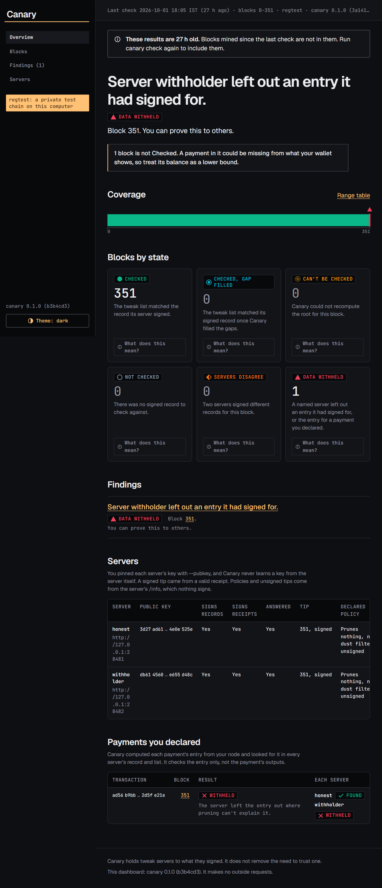
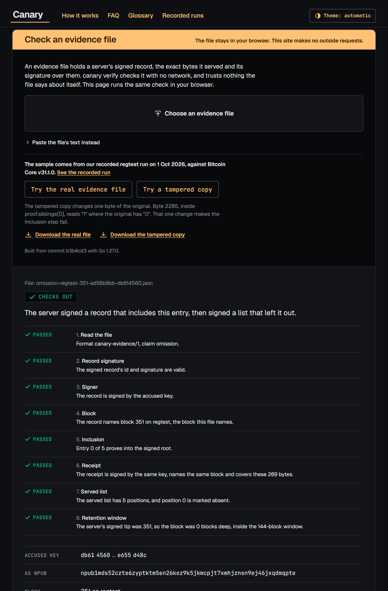

# Canary

**A silent-payments light wallet cannot tell "nobody paid you" from "the server left
your payment out."** Canary checks the tweak list a server sends against a list that the
same server signed and published for that block. When what the server sent contradicts
what it signed, Canary names the server and the block. On 1 Oct 2026 it did that in a run
on a real Bitcoin Core node in regtest mode. The server it named was the project's own
reference indexer, switched to withhold one payment. The evidence file from that run is in
this repository.

Canary does not make tweak sourcing trustless. It makes it *accountable*, under the two
conditions in the [security claim](#security-claim).

New to silent payments? [How Canary works](docs/how-canary-works.md) walks through the
checks with a worked example. The [FAQ](docs/faq.md) answers the usual objections, and the
[glossary](docs/glossary.md) defines every term.

## Check the evidence yourself

Run this from a clone of the repository, with Go 1.24.1 or later. The check needs no node,
no server and no network. Only the first build fetches Go modules, unless your module
cache already has them.

```
go run ./cmd/canary verify evidence/omission-regtest-351-ad56b9bb-db614560.json
```

It prints:

```
Checks out.
The server signed a record that includes this entry, then signed a list that left it out.
Accused key db614560…d48c. Block 351 on regtest, position 0, txid ad56b9bb…e21e.
  Read the file: Passed. Format canary-evidence/1, claim omission.
  Record signature: Passed. The signed record's id and signature are valid.
  Signer: Passed. The record is signed by the accused key.
  Block: Passed. The record names block 351 on regtest, the block this file names.
  Inclusion: Passed. Entry 0 of 5 proves into the signed root.
  Receipt: Passed. The receipt is signed by the same key, names the same block and covers these 269 bytes.
  Served list: Passed. The served list has 5 positions, and position 0 is marked absent.
  Retention window: Passed. The server's signed tip was 351, so the block was 0 blocks deep, inside the 144-block window.
```

The accusation rests on the accused server's own signatures. Its signed record for block
351 includes the entry. Its signed receipt covers the 269-byte list it served, where that
entry's position is marked absent. Without that receipt you could know the server
withheld the entry, but you could not prove it to anyone else. Servers must keep at least
the hash of every entry for 144 blocks, and the server's own signed tip puts this block
inside that window. A file that fails these checks does not make a server honest. It
means only that this file's claim fails.

### What happened in the recorded run

On 1 Oct 2026, `scripts/demo-regtest.sh --act5` ran end to end on Bitcoin Core v31.1.0 in
regtest mode. A wallet paid 1 BTC to a new taproot address in transaction `ad56b9bb…e21e`.
Block 351 confirmed it beside four other taproot payments, so the block's list has five
entries. Two reference indexers read the same node. The withholding one, key
`db614560…d48c`, ran with `--withhold-txid`. It left the payment out of the list it served,
and still signed the payment into its record for block 351.

`canary check` covered blocks 0 to 351, with both servers' keys pinned and the payment
declared. It reported 351 blocks Checked and 1 Data withheld, named the withholder for
block 351, and wrote the evidence file above.

Act 5 then checked block 201 alone, with only the withholder's key pinned and no payment
declared. Block 201 holds an earlier payment that the withholder also left out. The
withholder's signed tip puts that block 150 blocks deep, past the 144-block window, where a
server may send nothing for an entry. No other source could supply the entry. So block 201
reads Can't be checked, reason `gap_unfilled`. That is neither a pass nor an accusation.

`canary check` fetched each server's signed records from that server over HTTP. The run
published nothing to Nostr relays. Every command's output, both state files and both
indexer logs are in [docs/runs/2026-10-01](docs/runs/2026-10-01/).



*The local dashboard, `canary ui`, reading the recorded run's state file.*



*The browser checker on a copy of the site built and served locally, checking the same
evidence file. The site is not deployed yet.*

---

## Status (1 October 2026)

Canary is being built for [BOSS Battle](https://bitshala.org) (Bitshala), 7 Sep – 5 Oct
2026, Cypherpunk track. Version 1 is due on 5 Oct 2026 at 23:59 IST. One developer builds
it, working with Claude, Anthropic's AI assistant. Work continues after 5 Oct; the
[feature roadmap](docs/roadmap/2026-09-30-feature-roadmap.md) lists what comes next.

Every part of the v1 detection loop is built and tested. On 1 Oct the demo ran end to end
on Bitcoin Core v31.1 in regtest mode, as [the recorded run](#what-happened-in-the-recorded-run)
describes. The tests also run the loop on a synthetic regtest chain, which they build in
Go and serve the way Bitcoin Core's REST interface does.

| Part | State | What it does |
|---|---|---|
| `canonical` | Built and tested | Computes a block's complete tweak list from the block and the outputs it spends |
| `commit` | Built and tested | Hashes that list into a Merkle root bound to the network, the block hash and the entry count, with inclusion proofs |
| `feed` | Built and tested | Turns a commitment into a signed Nostr event and back. Its relay client is tested against a fake relay, and the v1 checker does not use it |
| `policy` | Built and tested | Holds a server's declared filtering rules, and reads them from blindbit-oracle's `/info` |
| `internal/testvector` | Built and tested | Defines the test-vector file format. One vector, an empty block, exists so far |
| `wire` | Built and tested | The tweak-list format a server sends, and the signed receipt that travels with it. The receipt carries the server's tip, which the 144-block retention rule reads |
| Reference indexer, `cmd/canary-indexer` | Built and tested | Signs one record per block and serves it with the tweak list and a receipt. `--withhold-txid` makes it leave a transaction out of what it serves, while its record still includes it |
| `ladder` | Built and tested | Gives each block a state and a reason code. It fills gaps before it recomputes the root |
| `evidence` | Built and tested | Writes and checks `canary-evidence/1` files. Checking a file needs no network |
| `canary check`, `verify`, `status`, `ui` | Built and tested | The command-line checker. `check --expect` is the tripwire. It checks the payments you declare, by their tweaks only |
| Local dashboard | Built and tested | `canary ui` serves the results on 127.0.0.1 and makes no outside requests |
| Public site generator, `cmd/site` | Built and tested | Writes the public site as static files, on the dashboard's design system. It copies the browser checker into the site |
| Browser checker, `cmd/verify-wasm` | Built and tested | Runs the same evidence check in a browser. The module is 8.68 MB, or 2.66 MB with gzip |
| A run on a real Bitcoin Core regtest node | Done on 1 Oct | `scripts/demo-regtest.sh --act5` ran end to end on Bitcoin Core v31.1.0. Its output, state files and logs are in [docs/runs/2026-10-01](docs/runs/2026-10-01/) |
| The real evidence file | Committed | `evidence/omission-regtest-351-ad56b9bb-db614560.json`, from that run. `TestCommittedEvidenceChecksOut` verifies it on every CI run |
| Recorded-run pages on the site | Built and tested | `go run ./cmd/site` reads `docs/runs` and builds pages for the 1 Oct run from its state files. They exist only in a local build until the site is deployed |
| Video, public site | Not done | No video is recorded yet, and the site is not deployed |

One end-to-end test, `TestGate` in `cmd/canary`, runs the v1 demo in one process. It goes
through the same code that the `canary` command and the reference indexer run. A synthetic
chain of 209 blocks feeds two reference indexers. One of them leaves a taproot payment out
of what it serves, while its signed record still includes it. The test checks four things,
and all four pass on macOS and on Linux amd64:

- `canary check` names the withholding server, the block and the txid, from that server's
  own signatures. Every block reads Checked for the honest server.
- The evidence file verifies in a process that the operating system cuts off from the
  network, so every connection is refused. On macOS the cut is a sandbox profile. On Linux
  it is a seccomp filter, and GitHub Actions runs that version on ubuntu-latest (amd64)
  on every push. It has passed on every push since it landed in commit `6c95886`. It has
  not run on Linux arm64. On other systems the test skips that step.
- A one-byte change fails the check at the step that covers that byte. The test changes
  the record signature, the accused key, the block height, a proof hash, the receipt and
  the served list, one at a time.
- The dashboard shows the finding under the server's name.

On 1 Oct, at commit `d52477d`, `go test ./... -count=1` passed in all 19 packages on Go
1.26.4, and again with `-race`. That is 413 top-level tests, one of them a fuzz test run
on its four seed inputs, and 791 passing cases once subtests are counted. None failed, and
none skipped. One of them verifies the committed evidence file. GitHub Actions runs
`go vet` and `go test` on Go 1.24 for every push, and every run on 1 Oct passed.

Version 1 is built and tested on regtest only, a private local test network. `canary
check` accepts regtest and mainnet only, and on mainnet it prints a notice that v1 is
tested on regtest only. It refuses signet and every other chain. Bitcoin Core reports only
the name "signet", and a custom signet takes its network magic from its challenge, so the
name does not say which signet it is. Signet needs a flag that names the network, which is
planned after v1. Nothing has been run against mainnet servers.

## Try it now

These commands work on today's code. They need Go 1.24.1 or later, and none of them needs
Bitcoin Core, a relay or a wallet. Run them from the repository root.

**See the recorded run in the dashboard.**

```
go run ./cmd/canary ui --state docs/runs/2026-10-01/state.json
```

Then open http://127.0.0.1:7352/, and stop it with Ctrl-C. This is the state file the
recorded run wrote, not sample data. For act 5, pass
`--state docs/runs/2026-10-01/act5/state.json` instead. The dashboard's evidence download
does not work here, because the state file points at the run's own output folder, which
the repository does not keep. The same file is in `evidence/`.

**Watch the end-to-end test.**

```
go test ./cmd/canary -run TestGate -v -count=1
```

It builds the synthetic chain, starts the two indexers and runs `canary check` against
them. Then it runs `status`, `verify` and `ui` on the files that check wrote. The last log
line gives the block count and how long each step took.

**See the dashboard, on sample data.**

```
go run -tags uidev ./cmd/canary-uidev
```

Then open http://127.0.0.1:7353/, and stop it with Ctrl-C. The data is made up and comes
from no run. Every page carries a "SAMPLE DATA" watermark that says so. Only a build with
the `uidev` tag carries sample data, so the `canary` command cannot show it.

**Build the public site, and serve it on this computer.**

```
make wasm
go run ./cmd/site -evidence evidence/omission-regtest-351-ad56b9bb-db614560.json
python3 -m http.server 8080 --bind 127.0.0.1 --directory site/dist
```

`make wasm` builds the browser checker into `bin/wasm` and prints its size. `go run
./cmd/site` copies the checker into the site and writes the site to `site/dist`, marked
noindex. With `-evidence`, the checker offers the recorded run's evidence file and a copy
with one byte changed. The last command needs Python 3. It serves the site at
http://127.0.0.1:8080/ until you press Ctrl-C.

## The problem

To receive silent payments (BIP-352) without downloading every block, a light wallet asks
a server for a [tweak](docs/glossary.md#tweak). A tweak is a 33-byte value per eligible
transaction, which the wallet combines with its own scan key. If the server leaves a
transaction out, the wallet never sees that payment. There is no error and no retry. The
wallet shows the same balance it would show if nobody had paid.

An indexer cannot tell which transactions pay a given silent-payment address, because
that needs the recipient's private scan key. So hiding one specific payment needs outside
knowledge of it. The party that always has that knowledge is the sender:

> **The exchange that pays you is also the indexer that tells you whether you were paid.**

Light wallets usually ship with a default server, often run by the wallet's vendor. When
the sender also runs that server, it holds a record showing it paid, and the recipient
sees nothing.

The gap is recognised, and it is still open:

- **BIP-352 leaves tweak sourcing open.** A footnote says: *"It is still an open question
  as to how Bob can source the 33 bytes per transaction in a trustless manner."* Its
  light-client appendix is *"out of scope for the current BIP"*. The BIP does not discuss
  a server withholding data.
- **Bitshala's BIP-352 guide** ([3 Aug 2026](https://x.com/bitshala_org/status/2084131259375296785))
  calls trustless tweak sourcing *"the big one"*. It says: *"A light client that accepts
  tweak data from a server has no way to detect omission."*
- **SomberNight**, the Electrum maintainer, described the attack in
  [cake_wallet#2395](https://github.com/cake-tech/cake_wallet/issues/2395) (July 2025).
  He wrote: *"I presently do not see a way how to fix this while using cut-through."*
- **The silent-payments
  [index-server specification](https://github.com/silent-payments/BIP0352-index-server-specification)**
  asks: *"How does a wallet know all tweaks were received for a given block request?"*

Sparrow 2.5.0 (May 2026) took a different route with its Frigate server. The wallet hands
its scan private key to the server, which does the scanning. That made scanning fast. The
wallet still depends on the server to report every payment, and the server now learns
them all, as Bitshala's guide points out.

## Prior art: SPCOMMIT, and what Canary adds

Canary is not the first to publish tweak-list commitments. Rob Segers's
[SPCOMMIT](https://github.com/bitsagarob/silentpayments-measurements), run by
silentpayments.net, has published them for mainnet since 1 Sep 2026. He posted the
specification to the
[bitcoin-dev mailing list](https://gnusha.org/pi/bitcoindev/6871d475-fbd4-4455-954d-20a369fba471n@googlegroups.com)
on 2 Sep. [Optech #422](https://bitcoinops.org/en/newsletters/2026/09/11/)
(11 Sep) described the scheme without using the name.

SPCOMMIT hashes each block's unfiltered tweak list and chains the hashes block to block.
It signs only the chain head, which the operator posts to Nostr every 6 hours as a kind-1
note. As of 30 Sep we found no wallet that checks it.

Canary adds three things. All three are built and tested. The
[recorded run](#what-happened-in-the-recorded-run) used each of them with a real Bitcoin
Core node in regtest mode, against the project's reference indexer. The
[status table](#status-1-october-2026) has the details.

- **A check at the client, one block at a time.** Each block gets its own signed Nostr
  event, found by block hash. A client can check one block without recomputing a chain.
  In v1, `canary check` fetches these events over HTTP from each server, not from relays.
- **Filtered responses leave explicit, signed gaps.** A server may leave entries out
  under a policy it declared in advance. Each entry it leaves out is a marked gap in a
  list whose length and Merkle root the server signed. So the client knows exactly which
  entries it did not receive, and tries to fill them from other sources. SPCOMMIT's own
  notes say a client given a filtered response *"cannot check the subset for
  completeness"*. Canary does not fully solve that either. Three conditions apply:
  - A gap sent as nothing while the block is less than 144 blocks deep names the server.
  - A gap sent as nothing further back, which no other source fills, ends as *Can't be
    checked*.
  - A gap sent as the entry's hash passes the per-block check, and the block reads
    *Checked, gap filled*. If the server declares no filtering, Canary also raises a
    warning, never an accusation, because v1 policies are unsigned. Under a declared
    pruning policy, only a tripwire on a payment you made catches it, and only while one
    of that payment's outputs is unspent; see
    [what Canary does not do](#what-canary-does-not-do).
- **Coverage states, evidence files and tripwires**, described below.

SPCOMMIT is ahead in two ways. Its v2 format also commits to each transaction's output-key
prefixes and to the block's spent outputs, which Canary does not; see
[what Canary does not do](#what-canary-does-not-do). Its hash chain also fixes the order of
all history, which Canary's separate per-block events do not.

## How Canary works

This section describes the design in
[`docs/design/2026-09-06-canary-design.md`](docs/design/2026-09-06-canary-design.md). The
status table above says which parts exist. [How Canary works](docs/how-canary-works.md)
follows one block through every check. Version 1 is a command-line checker plus a
reference indexer. The design's proxy, which sits between a wallet and its servers, comes
after v1.

**The key idea: servers may leave entries out, but never add them.** Honest servers
filter differently. Some delete entries whose outputs are all spent ("cut-through"), and
some skip small payments. Comparing their answers directly therefore produces only false
alarms. On 30 Sep, two live servers returned three different lists for mainnet block
969,300. silentpayments.dev returned 220 tweaks from its full index and 184 from its
filtered endpoint, and Cake Wallet's server returned 141. All 141 appear in the list of
220, and a raw comparison cannot tell whether the missing 79 were filtered or hidden.
That was a one-off measurement. The repository keeps the three counts, not the requests
or the responses, so nothing here re-runs it.

So each server signs a [commitment](docs/glossary.md#commitment) to the *complete,
unfiltered* list for every block, and serves whatever subset its policy allows. Two rules
follow:

- An entry a server sent that is not in its own signed list was made up.
- An entry in the signed list that the server did not send needs a reason declared in
  advance, and Canary tries to fill it from elsewhere.

The checks, cheapest first:

1. **Compare signed commitments across servers.** Each server signs a Nostr event of
   about 690 bytes per block. The recorded run's record for block 351 is 691 bytes. It
   carries a 32-byte Merkle root over the block's complete list, and that root is what
   Canary compares. If two servers sign different roots for the same block hash, at least
   one of them is lying. Canary cannot yet tell which, so it marks the block
   *disputed* and takes no automatic action.
2. **Check what you were sent, filling gaps first.** Canary rebuilds the root from what a
   server sent and compares it with the root that server signed. For an entry its policy
   pruned, a server may send the entry's 32-byte hash, or nothing at all.
   - A hash is enough to rebuild the root, so the block can pass without the full entry.
     This is the [hash-only limit](#what-canary-does-not-do).
   - For an entry sent as nothing, Canary tries to fill it from another source *before*
     it rebuilds the root. A block whose root was never rebuilt is never marked checked.
   - Servers must keep at least the hash of every entry for 144 blocks, about one day at
     10 minutes per block. If a server sends nothing for an entry while the block is less
     than 144 blocks deep, Canary names the server and marks the block *compromised*.
   - If an entry sent as nothing, outside the 144-block window, cannot be filled, the
     block is *unresolvable*. That is not a pass, and it is not an accusation.
   - If the rebuilt root differs from the signed one, the server sent data that
     contradicts its own signature. Canary names the server and marks the block
     *compromised*.
3. **Work out who lied.** Deciding which of two disagreeing servers lied means recomputing
   the complete list from the block and the outputs it spends. That needs a full node or
   another block source. A client without one keeps the signed evidence for someone who
   has one.
4. **The tripwire.** This check still works when every queried server colludes. You
   assert that a payment exists, because you sent it or because the sender gave you its
   transaction ID. Canary then checks whether each server reports it.
   - For a payment you sent yourself, Canary can compute the entry, because you hold the
     outputs your own transaction spent. It still needs one block hash it trusts from
     outside the servers. In v1 your own Bitcoin Core node supplies it.
   - If the server's signed record leaves that entry out, Canary names the server,
     whether or not the payment's outputs are spent.
   - If the server's list carries only the entry's hash, pruning could explain the gap.
     Canary then names the server only when your node shows one of the payment's taproot
     outputs unspent.
   - In both cases you know, but cannot yet prove it to others. v1's evidence file cannot
     show that a record lacks an entry, or that an output is unspent.
   - A transaction ID someone else gave you supports detection only, not naming a server.
   - A passed tripwire shows only that the server reported each declared tweak.
   - In v1 the tripwire is the payments you declare to `canary check`, one `--expect`
     flag each. It checks their tweaks only, not the output data. Scheduled test
     payments at random times and amounts come after v1.

**The main output is coverage, not alarms.** An alarm that never fires looks like a
product that does nothing. Coverage is reported per block range, in one of six states:

| Design name | On-screen label | Meaning |
|---|---|---|
| Verified | Checked | The root rebuilt over every position matched the root the server signed, and no position needed filling. This covers the tweak list, not payments |
| Resolved | Checked, gap filled | As Checked, but some positions came as hashes or were filled before the root was rebuilt. For example, another server supplied an entry, or Canary computed it from a payment you declared. An entry sent only as a hash can still hide a payment; see the [hash-only limit](#what-canary-does-not-do) |
| Unresolvable | Can't be checked | Canary could not rebuild the root. For example, an entry sent as nothing outside the 144-block window that no source could fill, or a signed record with no readable list. Not a pass, and not an accusation |
| Unverified | Not checked | There was no signed record to check against. For example, the server publishes none, has not indexed the block yet, or did not answer. A server that signed the blocks on both sides of this one, but not this one, also gets a warning, never an accusation |
| Disputed | Servers disagree | Two named servers signed different roots for the same block hash; which one lied is unknown |
| Compromised | Data withheld | One named server left out an entry it had signed for, or left out the entry for a payment you declared. For example, it sent nothing for an entry inside the 144-block window, or its list contradicts its own signed root |

Coverage also gives the most useful single sentence about a light wallet's balance:

> **A balance computed over blocks you could not verify is a lower bound, not a balance.**

Servers publish commitments as signed Nostr events. Nostr is a public bulletin board, and
servers need to run no extra infrastructure to use it. Nostr gives *publication*, not
timestamping. An event's `created_at` field is self-asserted and can be backdated. So
Canary ties each event to a block by the block's hash, and takes order from the chain,
never from `created_at`.

## What Canary does *not* do

- **It does not make tweak sourcing trustless.** It makes it *accountable*. If every
  indexer you query colludes and you have planted no tripwire, you learn nothing.
- **It does not check output data.** Canary commits to each transaction's ID and tweak.
  Wallets decide whether a payment exists from output data the server also sends: the
  BlindBit v1 output filter and `/utxos` list, or v2's `outputs_short`. A server can send
  the right tweak and drop the output, and v1 would still report the block as Checked.
  "Checked" means the tweak list was checked, never that payments were checked. Committing
  to outputs is planned after v1.
- **It does not check a lone server's record for completeness.** With one server, a
  record that already leaves out your entry passes, and the block reads Checked, reason
  `own_record`. A second honest server turns that block into *Servers disagree*, with
  nobody accused. A payment you declared with `--expect` names the server, but v1 cannot
  prove that to others.
- **It does not catch a hash-only entry under a pruning policy.** A server whose declared
  policy prunes spent entries may send just an entry's hash. The root still matches, so
  the block reads *Checked, gap filled*. If no other server sends the full entry, v1
  cannot tell this from honest pruning. Only a tripwire on a payment you made can, and
  only while your node shows one of that payment's outputs unspent. A server that
  declares no filtering and still sends a hash gets a warning, not an accusation,
  because v1 policies are unsigned.
- **It does not defend against commission**, meaning fake entries injected so that a
  client fetches a block and reveals its IP address. That is a different attack.
  Fetching blocks over short-lived Tor connections is the accepted answer there. Canary
  looks only for tweak-list entries that were hidden. The root check does reject a served
  entry that is missing from the server's own signed list, but that is a side effect,
  not a defence against this attack.
- **Version 1 is built and tested on regtest only**, against its own reference indexer.
  The tests run it on a synthetic chain. The one recorded run used a real Bitcoin Core
  v31.1 node, with that one node feeding both indexers and the checker. The indexer uses
  the same `canonical` package as the checker, so v1 does not test two independent
  implementations against each other.
- **Version 1 uses no relays.** `canary check` fetches each server's signed records over
  HTTP from that server, and the recorded run published nothing to Nostr relays. A finding
  against one server rests on that server's own signatures, and the cross-check between
  servers needs a second server. Publishing records to relays, which the security claim's
  second condition relies on, comes after v1.
- **It does not make scanning faster.** Frigate made scanning faster. Canary is about
  whether the data is complete, which is a separate question.
- **It is not a wallet**, not a new Bitcoin Core filter type, and not a succinct proof of
  correct indexing. That last one is the long-term answer and is listed as future work.

## Security claim

> Given at least one honest indexer publishing commitments, and an uncensored path to
> at least one relay carrying them, Canary converts omission from a silent, permanent
> failure into a detected event naming a server and a block.

Three qualifiers travel with the claim:

- **Omission here means a missing tweak-list entry.** Hidden output data is outside the
  claim; see [what Canary does not do](#what-canary-does-not-do).
- **Detection is not proof.** When two servers sign different roots for the same block
  hash, anyone can check both signatures, so the disagreement is provable. It does not
  show which server lied. A single server's omission is provable to others only when that
  server signs receipts over its responses. In v1 it also needs the server's signed
  record to include the entry that was left out. Against today's unmodified indexers,
  the victim knows but cannot prove it.
- **Timing depends on the attack.** Disagreement between servers shows up in the
  commitment feed, roughly one block interval after the block. Hiding one payment from
  one client shows up only when that client checks that block. In v1 there is no
  background service, so every check happens when you run `canary check`.

What each assumption buys:

| Assumption | What Canary can detect |
|---|---|
| One indexer, publishing commitments | That indexer sending you less than it signed for. Two exceptions: the hash-only case above, and an entry sent as nothing outside the 144-block window that no other source fills, which ends as *Can't be checked* |
| Several indexers, at least one honest | Also an indexer that signed for a list with the entry removed, because its root disagrees |
| All indexers colluding | Only what a tripwire finds, and only for payments you already know exist |

This is [Certificate Transparency](https://www.rfc-editor.org/rfc/rfc6962)'s split-view
problem: a server showing different people different data. Certificate Transparency
answers it with gossip between clients. Canary's design answers it with public Nostr
relays, which v1 does not use yet. The
full comparison with earlier work, including
[Delving Bitcoin thread 891](https://delvingbitcoin.org/t/silent-payments-light-client-protocol/891),
is in [`docs/research/prior-art.md`](docs/research/prior-art.md).

## Build and test

Canary needs Go 1.24.1 or later. The tests need no Bitcoin Core node, network access or
relay.

```
make help    # list the targets
make test    # go test ./...
make vet     # go vet ./...
make wasm    # build the browser checker into bin/wasm and print its size
```

## Repository layout

```
canonical/               the complete tweak list for one block
commit/                  Merkle root, commitment and inclusion proofs
feed/                    commitments as signed Nostr events, and a relay client
policy/                  a server's declared filtering rules
wire/                    the tweak-list format a server sends, and its signed receipt
ladder/                  one block's state and reason, with gaps filled first
evidence/                canary-evidence/1 files, written and checked offline, and the recorded run's file
cmd/canary/              check, verify, status and ui, and the end-to-end gate test
cmd/canary-indexer/      the reference indexer, with --withhold-txid
cmd/canary-uidev/        the dashboard on sample data, built only with -tags uidev
cmd/site/                the public site generator
cmd/verify-wasm/         the browser checker, built by make wasm
internal/core/           a client for Bitcoin Core's REST interface
internal/core/coretest/  a synthetic regtest chain, served like Core's REST interface
internal/indexer/        the reference indexer's records, receipts and HTTP routes
internal/state/          the state file that check writes and ui reads
internal/testvector/     the test-vector file format and its runner
internal/ui/             the local dashboard and the design system the site shares
internal/ui/wording/     every user-facing sentence, shared by the CLI, dashboard and browser
site/                    the site's HTTP headers; the build goes to site/dist
scripts/                 demo-regtest.sh, the v1 demo on a real Bitcoin Core regtest node
testdata/                BIP-352 upstream vectors and Canary's own vectors
docs/*.md                how it works, the FAQ, the glossary and the decision log
docs/runs/2026-10-01/    the recorded run: each command's output, state files and logs
docs/media/              screenshots from the recorded run
docs/submission/         the BOSS Battle submission pack
docs/design/             the design document and the frozen v1 formats
docs/research/           prior art with citations, and the competitor analysis
docs/roadmap/            the scored feature roadmap, with the v1 cut line
docs/superpowers/plans/  the 8 September implementation plans
```

## For contributors

The BOSS Battle submission pack lives in `docs/submission/`:

- [Devfolio fields](docs/submission/devfolio.md) holds the text for each form field. The
  recorded run filled its brackets, except the video link and the site address.
- [Video script](docs/submission/video-script.md) gives each shot's time, screen,
  narration and caption, and the commands to set up the run on camera.
- [Final-day checklist](docs/submission/checklist.md) lists the steps for Monday
  5 Oct in IST, with the commands.

## License

Canary is released under the [MIT license](LICENSE). The self-hosted Geist and JetBrains
Mono fonts in `internal/ui/assets/fonts` keep their own SIL Open Font License, which sits
beside them.
