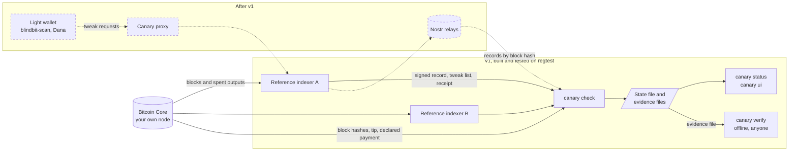
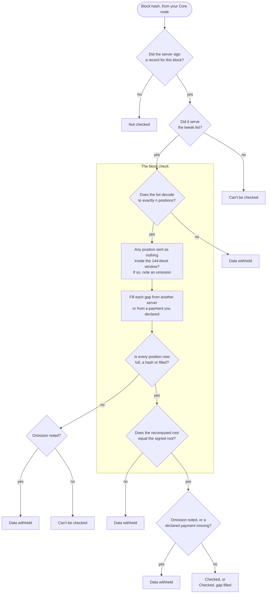

# How Canary works

This page is for a reader who knows Bitcoin but not silent payments. Terms link to the
[glossary](glossary.md) on first use. The [design document](design/2026-09-06-canary-design.md)
gives the full reasoning, and [v1 formats](design/2026-09-30-v1-formats.md) pins every
byte.

## The problem

A [silent-payments](glossary.md#silent-payments) [light wallet](glossary.md#light-wallet)
asks a server for the [tweaks](glossary.md#tweak) it scans with. Computing them needs the
outputs each transaction spent, which the wallet does not have. If the server leaves out
the tweak for your payment, the wallet shows the balance it would show if nobody had paid
you, and no error.
The sender always knows the payment, so an exchange that also runs your wallet's server
can hide its own payment from you.

Canary makes that server [accountable](glossary.md#accountable). It checks what a server
sent for a block against what the same server signed for that block, and names the server
when the two disagree. It does not make tweak sourcing trustless; it makes it
accountable. The claim holds under two
conditions: at least one honest server publishes signed records, and you have an
uncensored path to a [relay](glossary.md#relay) that carries them.

## The parts

Solid lines exist in v1. Dashed lines and boxes come after v1.

- **v1.** `canary check` asks every configured server for each block's signed record and
  tweak list over HTTP. Your own Bitcoin Core node supplies the block hashes, the chain
  tip and any payment you declared. The run writes a state file, which `canary status`
  and `canary ui` read. For each omission it can document from signed data, it also
  writes an evidence file. `canary verify` checks an evidence file with the network off.
- **After v1.** A proxy sits in a wallet's data path and refuses blocks that read Data
  withheld or Servers disagree. It targets BlindBit v1 clients such as blindbit-scan and
  Dana. Servers also publish their records to Nostr relays. v1 has no wallet in the loop,
  so a finding reaches you only when you run `canary check`.

## What a server signs and serves

Honest servers filter differently. Some drop entries whose outputs are all spent, which is
[cut-through](glossary.md#cut-through), and some drop small payments with a
[dust filter](glossary.md#dust-filter). Comparing what two servers serve therefore raises
false alarms. On 30 Sep 2026, one mainnet block came back as 220, 184 and 141 tweaks from
three endpoints, and a raw comparison cannot say whether the missing ones were filtered
or hidden ([FAQ](faq.md#why-not-diff-two-servers)).

So Canary asks each server to sign for the complete list and lets it serve less. For each
block, a server:

1. Computes the [canonical set](glossary.md#canonical-set): one
   [entry](glossary.md#entry), a txid and its tweak, for every eligible transaction, in
   transaction order.
2. Signs a [record](glossary.md#signed-record) holding the entry count `n` and a
   32-byte [Merkle root](glossary.md#merkle-root) over the entries. It signs once, when
   it indexes the block.
3. Serves a [tweak list](glossary.md#tweak-list) of exactly `n` positions. Each position
   carries the full entry, its 32-byte hash, or nothing.
4. Signs a [receipt](glossary.md#receipt) over the exact bytes it served, including its
   current tip.

One rule follows. **A server may leave entries out, and must account for each one.**
Canary looks only for entries left out. A served entry missing from the server's own
record also breaks the root check, but that is a side effect, not a defence against fake
entries.

## The checks, for one server and one block

**Filling happens inside the block check, before the root is recomputed.** Suppose the
root were recomputed first. A server that sent nothing for one position would make the
root impossible to compute, so the block would never be checked, and the attack would
pass without a trace. Canary never marks a block Checked unless it recomputed the root.

**The window check names the server early and does not stop the check.** An entry sent as
nothing inside the [retention window](glossary.md#retention-window) is an omission
whatever happens next. Canary still fills the gap and recomputes the root, because the
recovered entry names the transaction that was left out, and the proof ties it to the
server's own signature.

Three details the chart leaves out:

- An entry sent as nothing outside the window is allowed. The server's excuse is then its
  own signed tip, so Canary checks that tip against your Core node. A tip that Core
  contradicts reads Data withheld, as a false chain claim.
- An unsigned list that fails to decode reads Can't be checked, because nothing the server
  signed shows those bytes. A signed list that fails, or any list of the wrong length,
  reads Data withheld.
- Take a declared payment whose entry is sent only as a hash, or as nothing outside the
  window. It reads Data withheld only when your node shows one of its taproot outputs
  unspent. Pruning could explain a spent one.

**Across servers.** Canary then compares roots for the same block hash. Two different
roots mean the block reads Servers disagree, naming both servers, without saying which
lied. A block's state combines its servers' results in this order of precedence: Data
withheld; Servers disagree; Checked; Checked, gap filled; Can't be checked; Not checked.

## A worked example: one block, five entries

Two reference indexers, A and B, run on regtest. Both declare no pruning in `/info`, as
the v1 reference indexer always does. The block at height 205 holds five eligible
transactions, so its canonical set has five entries, e0 to e4. When A indexed the block,
it signed a record with `n` = 5 and root R. B signed the same root, because it indexed
the same block.

You run `canary check`, and A serves this list with a receipt whose signed tip is 212:

| Position | A sends | Bytes |
|---|---|---|
| 0 | e0 in full | 66 |
| 1 | e1 in full | 66 |
| 2 | the hash of e2 | 33 |
| 3 | nothing | 1 |
| 4 | e4 in full | 66 |

With the 4-byte count, the list is 4 + 66 + 66 + 33 + 1 + 66 = 236 bytes.

1. **Record.** A's record verifies under the key you pinned for A. It names this block
   hash and regtest, and says `n` = 5.
2. **List and receipt.** The receipt is valid under the same key. It names the same block,
   and its SHA-256 covers these 236 bytes.
3. **Decode.** The list has five positions, matching `n`.
4. **Window.** Position 3 is empty. The depth is 212 − 205 = 7, inside the 144-block
   window, so A had to keep at least e3's hash. Canary notes an omission against A.
   Position 2 is a hash, which meets the rule.
5. **Fill.** B's list carries e2 and e3 in full. Canary takes them.
6. **Root.** Canary hashes all five entries, builds the tree and recomputes the root. It
   equals R, so e3 is exactly the entry A signed for and then left out.
7. **Across servers.** B's root is also R, so the servers agree.

**Result.** A's result for the block is **Data withheld**, reason `absent_in_window`. The
finding names A, block 205, position 3 and e3's txid. Canary writes an evidence file with
A's record, the receipt, the 236 served bytes, e3 and a proof of three sibling hashes.
`canary verify` on that file prints "Checks out." with no network. B's own result is
Checked, and the block reads Data withheld. A declares no pruning, so the hash at
position 2 also raises a `hash_without_policy` warning, and a warning is never an
accusation.

**Change one thing.** Each row changes the example once, and shows A's own result. Every
row where A still sends a hash also carries that warning.

| Change | A's result | Reason | Can others check it? |
|---|---|---|---|
| None | Data withheld | `absent_in_window` | Yes. The evidence file checks out offline |
| The list arrives without a receipt | Data withheld | `absent_in_window` | Inclusion only. Others see that A signed for e3, not that A left it out |
| Position 3 sent as a hash, and B not configured | Checked, gap filled | `hash_retained` | No accusation. Canary cannot tell pruning from hiding here |
| A's signed tip is 360, so the depth is 155; your node confirms that tip; B supplies e3 | Checked, gap filled | `filled_from_server` | No accusation |
| As above, and B not configured | Can't be checked | `gap_unfilled` | No accusation, and not a pass either |
| A's signed tip is 360, but your node's tip is 212 | Data withheld | `false_chain_claim` | No. Checking it needs a node, and v1 has no evidence format for it |
| All five sent in full, and B signed the same root | Checked | `records_agree` | No finding |
| All five sent in full, and B not configured | Checked | `own_record` | No finding. Nothing checks that A's record is complete |
| A signed `n` = 4 without e3, and served that list | Servers disagree | `records_differ` | Both records are signed. Neither says which server lied |
| As above, and you declared e3's payment with `--expect` | Data withheld | `expected_payment_not_in_record` | No. You know, and v1 cannot prove an entry is missing from a root |
| A signed records for blocks 204 and 206, but none for 205 | Not checked | `no_record_for_block` | A warning, not an accusation |

## The six states

| On screen | What it means |
|---|---|
| Checked | The root recomputed over every position matched the server's signed root, and no position needed filling |
| Checked, gap filled | As Checked, but some positions came as hashes or were filled from another source first |
| Can't be checked | Canary could not recompute the root. Neither a pass nor an accusation |
| Not checked | There was no signed record to check against. Nothing about the block was checked |
| Servers disagree | Two servers signed different roots for the same block hash. At least one lied, and Canary does not know which |
| Data withheld | One named server left out an entry it had signed for, or the entry for a payment you declared |

**Checked means the tweak list was checked. It never means the payments were checked.**
The [glossary](glossary.md#states) gives each state's code and design name.

Coverage over many blocks gives the one sentence worth remembering: **a balance computed
over blocks you could not check is a lower bound, not a balance.**

## What Canary proves, and what it does not

Canary separates knowing from proving to others. You know whatever your own
`canary check` saw. Someone else can confirm a finding only from signed data they can
check themselves: an evidence file with a receipt. The [FAQ](faq.md#is-a-detected-omission-proof)
lists which findings others can check.

The security claim, with its conditions attached:

> Given at least one honest indexer publishing commitments, and an uncensored path to at
> least one relay carrying them, Canary converts omission from a silent, permanent failure
> into a detected event naming a server and a block.

Each part of that claim has a limit, and the limit belongs next to it:

- **Checked covers the tweak list, not the [output data](glossary.md#output-data) a
  wallet matches against.** A server can serve the right tweak and hide the output, and
  the block still reads Checked ([FAQ](faq.md#what-about-the-output-data-wallets-actually-match-against)).
- **A hash under a declared pruning policy is not named.** The root still matches, so the
  block reads Checked, gap filled. A second server that serves the entry in full recovers
  the payment. A tripwire on your own payment catches it while one of that payment's
  taproot outputs is unspent, and that finding is not provable to others. A server that
  declares no pruning and sends a hash gets a warning, never an accusation, because v1
  policies are unsigned.
- **Detection happens only when you run `canary check`.** v1 has no wallet in the loop
  and no proxy, so nothing stops a wallet from using a block Canary flagged.
- **v1 is built and tested on regtest only,** against its own reference indexer, which
  shares the `canonical` package with the checker. Matching results test the protocol,
  not two independent implementations. No deployed server speaks this API yet
  ([FAQ](faq.md#is-the-v1-reference-indexer-an-independent-implementation)).
- **If every server colludes,** only a [tripwire](glossary.md#tripwire) helps, and only
  for payments you know exist.
- **The second condition, a path to a relay, is not exercised in v1.** v1 fetches records
  over HTTP from each server and does not publish them to relays.
- **Canary looks for hiding only.** A server that adds fake entries is running a
  different attack ([FAQ](faq.md#does-canary-stop-fake-entries)).

Nostr gives publication, not timestamping. An event's `created_at` time is whatever the
signer wrote, so Canary ties each record to a block by its hash and takes order from the
chain.

The design lists these limits in [Limits of v1](design/2026-09-06-canary-design.md#limits-of-v1).

## Prior art

Canary applies the split-view idea from Certificate Transparency
([RFC 6962](https://www.rfc-editor.org/rfc/rfc6962)): make a server sign one public
statement that anyone can compare with what they were shown. What it adds is honest
filtering. It commits each server to one unfiltered list per block and lets it serve
less, with every gap marked.

Rob Segers's [SPCOMMIT](https://github.com/bitsagarob/silentpayments-measurements) came
first, with tweak-list commitments for mainnet since 1 Sep 2026. The FAQ compares the two
([Certificate Transparency](faq.md#isnt-this-certificate-transparency),
[SPCOMMIT](faq.md#how-is-this-different-from-spcommit)), and
[Prior art and gap analysis](research/prior-art.md) has the full survey, with sources and
dates.
